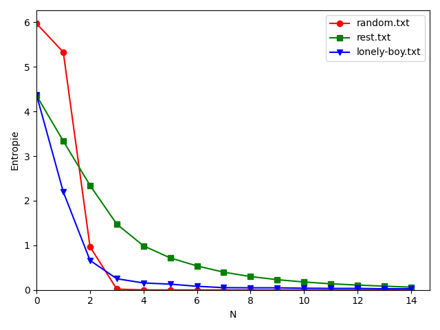

# Inleiding tot de Telecommunicatie - Verslag Opdracht 1

__Naam student__ : Liouka Antchougov

## Uitleg over implementatie
Ik heb ervoor gekozen om mij te focussen op tekstbestanden. Mijn implementatie is geschreven in Python.

Het programma verwacht twee argumenten:

- Tekst waarvoor de entropie berekend moet worden. Dit moet meegegeven worden via standaardinvoer.
- De grootte N van het geheugen van de informatiebron. Dit moet meegegeven worden als command line argument, en dit moet een geheel, niet-negatief getal zijn.

Een voorbeeldoproep waarbij er uit wordt gegaan van een geheugenloze bron ziet er zo uit:

```bash
echo "aaabbbccc" | python3 entropy.py 0 
```

Het programma print de entropie van de tekstbron naar standaarduitvoer. De uitvoer van de bovenstaande voorbeeldoproep is als volgt:

``` Entropy with memory size 0 = 1.8954618442383218```

## Vraag 1

De 3 tekstdocumenten wiens entropieën ik heb gekozen om te vergelijken zijn: een liedje, een hoofdstuk uit Roy Fielding's proefschrift over REST, en een pseudo-random tekst. De pseudo-random tekst is gegenereerd met het alfabet `ABCDEFGHIJKLMNOPQRSTUVWXYZabcdefghijklmnopqrstuvwxyz0123456789\n` , en bestaat uit 5000 karakters.


Als we uitgaan van een geheugenloze bron, hebben het liedje en het proefschrift met respectievelijke entropieën van 4,37 en 4,36 bijna identieke entropieën. Dit hoeft ons niet te verbazen: beide teksten zijn geschreven in de Engelse taal, en dus zullen de tekens in beide teksten hoogstwaarschijnlijk ongeveer dezelfde probabiliteiten hebben.


De pseudo-random tekst heeft daarentegen een hogere entropie van 5,97. Deze hoge entropie ligt aan het feit dat de kansverdeling van de informatiebron ongeveer uniform is. De entropie van deze tekst komt dus dicht bij de maximale entropie die je kunt hebben voor een tekst die met dit alfabet is gegenereerd.

## Vraag 2

Ik heb de entropie berekend en gevisualiseerd voor het geheugen `N` gaande van 0 t.e.m. 15. De bestandsnamen van de vergeleken documenten `random.txt`, `rest.txt` en `lonely-boy.txt`  komen respectievelijk overeen met de pseudowillekeurige tekst, het proefschrift en het liedje.


De entropieën van alle teksten lijken strict-dalend te zijn voor stijgende `N`, en uiteindelijk te convergeren naar 0. We kunnen dit als volgt verklaren: hoe groter het geheugen wordt, hoe groter de kans wordt dat je een bepaald teken tegenkomt gegeven een bepaalde reeks tekens. Dit komt omdat er voor grotere `N` meestal geen structuur meer te vinden is in het geheugen van de tekstbron. Bijvoorbeeld: een gesproken taal heeft veel woorden die beginnen met dezelfde reeks karakters, maar gevolgd worden door een verschillende reeks karakters (bijvoorbeeld "natuurlijk" en "natuurramp"). Omdat de vorming van woorden in gesproken talen een structuur heeft, zul je veel reeksen hebben waarbij er nog veel variatie mogelijk is op het volgende karakter van die reeks. Echter, wanneer het geheugen te groot wordt, verdwijnt deze structuur, en is er weinig kans op variatie op het volgende teken van een bepaalde reeks. Dit betekent dat in de berekening van de conditionele entropie van teksten met een groot geheugen, er vaak het logaritme genomen zal worden van een conditionele kans die bijna 1 is. Hierdoor zullen veel termen van de sommatie bijna 0 zijn, en wordt de sommatie, en dus de entropie, ook bijna 0.


De entropie lijkt veel sneller te dalen voor de pseudowillekeurige tekst dan voor de 2 niet-willekeurige teksten. Dit is waarschijnlijk omdat een pseudowillekeurige reeks karakters van het begin bijna geen structuur heeft, in tegenstelling tot een niet-willekeurige reeks karakters uit een gesproken taal. Voor een relatief kleine `N` zul je dus in een pseudowillekeurige tekst meestal reeksen beschouwen die een zeer kleine kans hebben om voor te komen. Dit betekent dat er weinig mogelijke variatie is op het volgende teken van een bepaalde reeks van lengte `N`. Een pseudowillekeurige tekst verliest dus voor stijgende `N` veel sneller zijn structuur dan een niet-willekeurige tekst, en dus convergeert de entropie van pseudowillekeurige teksten sneller naar 0.


Er lijkt ook een opmerkelijk verschil te zijn in de daling van de entropie tussen het liedje en het proefschrift: de entropie van het proefschrift convergeert trager naar 0 dan die van het liedje. Een mogelijke verklaring hiervoor is dat de entropie van het proefschrift trager daalt omdat de lengte van de tekst veel groter is dan die van het liedje. Het proefschrift bevat 45655 karakters, terwijl het liedje er slechts 894 heeft. Omdat het liedje een kortere tekst heeft, worden dezelfde reeksen van karakters vaker gevolgd door hetzelfde karakter: er zijn immers minder mogelijke reeksen, dus is er niet veel mogelijkheid op variatie op het volgende teken. Daarbovenop bevatten liedjes vaak veel herhaling. Dit betekent dat voor stijgende `N` de conditionele kansen op tekens gegeven `N` vorige tekens relatief snel stijgen. Voor het langere proefschrift blijft er voor stijgende `N` echter meer mogelijkheid op variatie van volgende tekens, omdat er meer mogelijke reeksen zijn en omdat er in zo'n tekst minder herhaling is dan in een liedje. De entropie van het proefschrift convergeert dus trager voor stijgende `N`.



